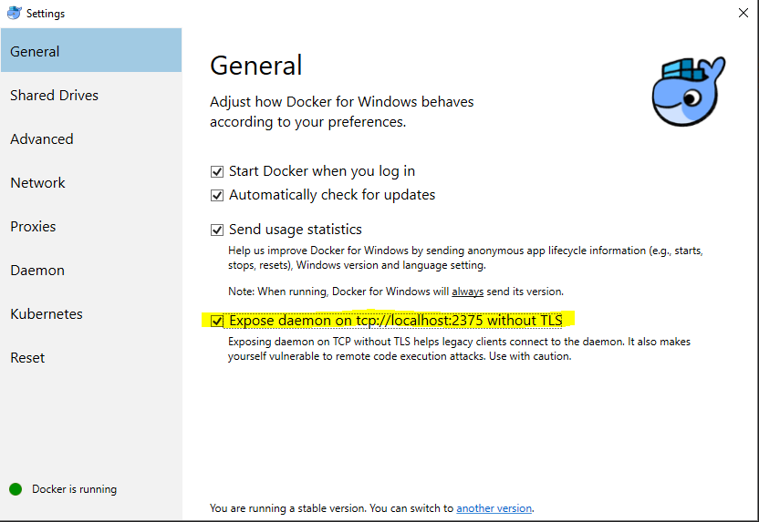

 &#x2003; 
# Asynk POSTGRES
A Postgres async client with suspend functions for kotlin coroutines.

## Download ##

The maven artifacts are on [Bintray](https://bintray.com/programingjd/maven/info.jdavid.asynk.postgres/view)
and [jcenter](https://bintray.com/search?query=info.jdavid.asynk.postgres).

[Download](https://bintray.com/artifact/download/programingjd/maven/info/jdavid/asynk/postgres/0.0.0.9/postgres-0.0.0.9.jar) the latest jar.

__Maven__

Include [those settings](https://bintray.com/repo/downloadMavenRepoSettingsFile/downloadSettings?repoPath=%2Fbintray%2Fjcenter)
 to be able to resolve jcenter artifacts.
```
<dependency>
  <groupId>info.jdavid.asynk</groupId>
  <artifactId>postgres</artifactId>
  <version>0.0.0.9</version>
</dependency>
```
__Gradle__

Add jcenter to the list of maven repositories.
```
repositories {
  jcenter()
}
```
```
dependencies {
  compile 'info.jdavid.asynk:postgres:0.0.0.9'
}
```

## Usage ##

__Connecting__

```kotlin
val credentials = 
  PostgresAuthentication.Credentials.PasswordCredentials("user", "password")
val serverAddress = InetAddress.getByName("hostname")
println(
  runBlocking {
    credentials.connectTo("database", InetSocketAddress(serverAddress, db.port)).use { connection ->
      // returns a list of one row as a map of key (column name or alias) to value.
      connection.rows("SELECT VERSION();").toList().first().values.first()
    }
  }
)
```

__Fetching rows__

```kotlin
val total = 
  connection.rows("SELECT COUNT(*) FROM table;").let {
    val row = it.toList().first() // only one row
    row.values.first() // only one value
  }

val max = 123
val count =
  connection.rows(
    "SELECT COUNT(*) FROM table WHERE id > ?;",
    listOf(max)
  ).let {
    val row = it.toList().first() // only one row
    row.values.first() // only one value
  }

val ids = ArrayList<Int>(count)
for (val row in connection.rows("SELECT COUNT(*) FROM table WHERE id > ?;", listOf(max)) {
  ids.add(row["id"] ?: throw RuntimeException())
}
```

__Updating rows__

```kotlin
println(
  connection.affectedRows("UPDATE table SET key = ? WHERE id = ?", listOf("a", 1))
)

println(
  connection.prepare("DELETE FROM table WHERE id = ?").use { statement ->
    listOf(1, 3, 4, 6, 9).count { id ->
      statement.affectedRows(listOf(id)) == 1
    }
  }
)
```

## Tests ##

The unit tests assume that docker is running and that the docker daemon is exposed on tcp port 2375.
This option is not enabled by default.
On windows, you will also get prompts to give permission to share your drive that you have to accept.

